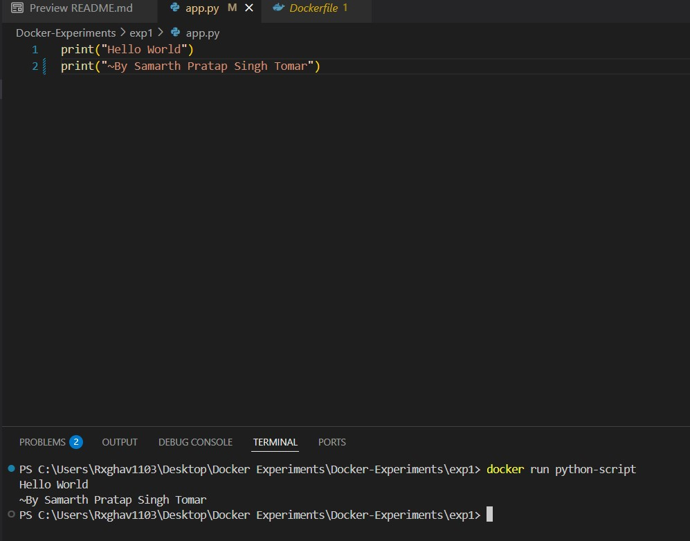

# 🔹 Experiment 1: Run a Basic Python Script with Docker

This experiment demonstrates how to run a basic Python script using Docker. It’s the simplest way to containerize a Python program and get started with Docker development.

---

## 📁 Folder Structure

```
exp1/
├── Dockerfile
├── app.py
└── exp1.jpg    # Screenshot of the running output
```

---

## 🧠 What This Does

- Uses a minimal Python 3.9 base image.
- Copies all files into the container.
- Runs a Python script (`app.py`) when the container starts.

---

## 📝 app.py

```python
print("Hello from Dockerized Python App!")
```

This script just prints a message to the console when executed inside the Docker container.

---

## 🐳 Dockerfile

```dockerfile
# Use an official Python runtime as the base image
FROM python:3.9-slim

# Set the working directory in the container
WORKDIR /app

# Copy the current directory contents into the container at /app
COPY . /app

# Run the Python script
CMD ["python", "app.py"]
```

---

## 🛠️ How to Run This

### ✅ Step 1: Build the Docker Image

```bash
cd exp1
docker build -t python-script .
```

### ▶️ Step 2: Run the Container

```bash
docker run python-script
```

You should see the output:

```
Hello from Dockerized Python App!
```

---

## 📸 Output Screenshot

Below is a snapshot of the terminal output when the container runs successfully:



---

## ✅ Requirements

- Docker installed → [Get Docker](https://docs.docker.com/get-docker/)
- Internet connection (only for image download on first run)

---

## 📢 License

This project is licensed under the MIT License.

---

> 🚀 A great first step into containerizing Python applications!
```

